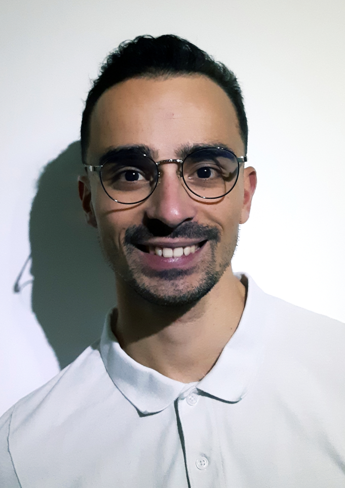

G.CLARO Sebastien
=================

[[**GitHub**: s3bc40.github.io]](https://s3bc40.github.io/)
[[**LinkedIn**: sgoncalvesclaro-bioinfo]](https://www.linkedin.com/in/sgoncalvesclaro-bioinfo/)
[[**Insta**: s_gclaro]](https://www.instagram.com/s_gclaro/)
[[**Reddit**: u/s3bc40]](https://www.reddit.com/user/s3bc40)
[[**Email**: s.goncalvesclaro@gmail.com]](s.goncalvesclaro@gmail.com)
[**Tel**: 0624524788]

About
--------

Computational bioinformatician with a passion for Data Science and Web application development.  
The environment, hiking, and video games are also my interests.

Experiences
----------

**Web developer consultant for MCA-Group, Axileo** (Sept 2019 - May 2020, Paris)

+ Development and updating of various internal software: MANAGEO, Intranet, Competence profile. Assistance and technical support (software) to users on-site and remotely. Maintenance assistance for different tools, and version migration.

>*Tools : PHP(7), Symfony(2.8,3.4), PHPMyAdmin, HTML5/CSS3, JavaScript, jQuery, SQL, Windows, PHPStorm, Talend*

**TNBC cancer subtype research and prediction, Sorbonne University** (Feb 2019 - August 2020, Paris)

+ Internship dedicated to setting up a workflow for predicting the cancer subtype *Triple Negative Breast Cancer* (TNBC). Data processing, preprocessing, and Machine Learning (Random Forest, XGBoost, Logistic Regression).

>*Tools : Python(3), R, Anaconda, Bioconductor, NumPy, pandas, matplotlib, Seaborn, scikit-learn*

Formations
---------

**Data Science Bootcamp, 365DataScience** (May 2020 - June 2020, Udemy)

+ Statistical analysis. Programming with NumPy, pandas, matplotlib, and Seaborn. Advanced statistical analysis. Tableau. Machine Learning with statsmodels and scikit-learn. Deep learning with TensorFlow2. 29h with [certification](../assets/pdf/certif_DS.pdf).

**Master Computational Bioinformatics course** (2017 - 2019, University of Bordeaux)

+ Statistical data processing. Algorithmics: recursion, tree traversal. Qualitative, quantitative modeling and dynamic process modeling. Structural bioinformatics.

Skills
---------

**Data Science:** Python, R language, SQL, Anaconda, NumPy, pandas, matplotlib, Seaborn, statsmodels, scikit-learn, Tensorflow, Jupyter notebook

**Web development:** HTML5/CSS3, JavaScript, jQuery, Bootstrap, PHP, Symfony, Django, d3.js, chart.js

**Soft skills:** sens du collectif, curiosité, résolution de problèmes, intelligence émotionnelle, empathie, communication
