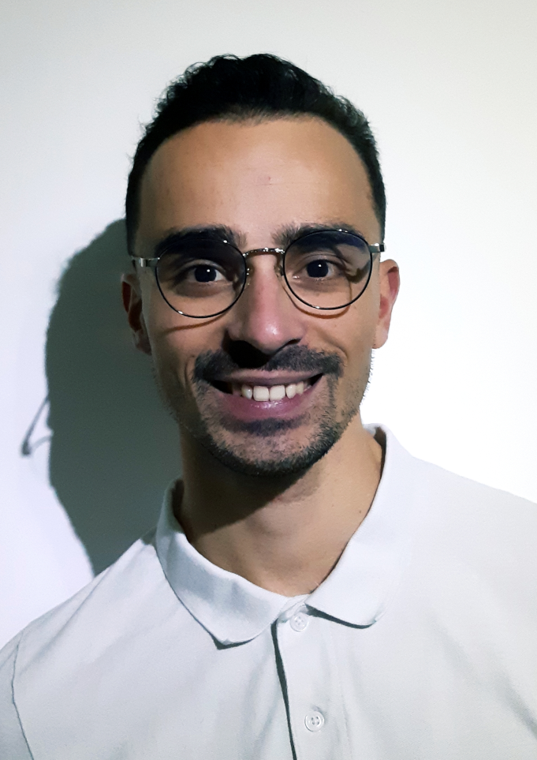

# G.CLARO Sébastien

[[**GitHub**: s3bc40.github.io]](https://s3bc40.github.io/)
[[**LinkedIn**: sgoncalvesclaro-bioinfo]](https://www.linkedin.com/in/sgoncalvesclaro-bioinfo/)
[[**Insta**: s_gclaro]](https://www.instagram.com/s_gclaro/)
[[**Reddit**: u/s3bc40]](https://www.reddit.com/user/s3bc40)
[[**Email**: s.goncalvesclaro@gmail.com]](mailto:s.goncalvesclaro@gmail.com)
[**Tel**: 0624524788]

## About

Développeur informatique intéressé par la Data Science et le développement d'application Web.
L'écologie, les randonnées, le badminton, la course à pied, les jeux vidéos et les chiens sont mes centres d'intérêts.

## Experiences

**[EMPLOI] - Consultant développeur web pour MCA-Group, Axileo** (Sept 2019 - Mai 2020, Paris)

+ Développement et mise à jour des différents logiciels en interne : MANAGEO, Intranet, DTThèque. Création des comptes utilisateurs. Assistance et support technique (logiciel) auprès des utilisateurs sur site et à distance. Création de procédures informatiques: mises à jour, avenants. Assistance maintenance des différents outils, et migration de version.

>*Outils : PHP(7), Symfony(2.8,3.4), PHPMyAdmin, HTML5/CSS3, JavaScript, jQuery, SQL, Windows, PHPStorm, Talend*

**[STAGE] - Recherche et prédiction du sous-type de cancer TNBC, Université Sorbonne** (Fev 2019 - Août 2020, Paris)

+ Stage de fin de formation de Master Bioinformatique effectué au [Laboratoire de Biologie Computationnelle et Quantitative](http://www.lcqb.upmc.fr/), à l’Université de Sorbonne. Recherche et prédiction d’une réponse à un traitement contre un sous-type de cancer du sein, à l’aide de l’apprentissage supervisé. Présentation hebdomadaire des recherches avec les collaborateurs biologistes de l'Inserm.

>*Outils : Python(3), R, Anaconda, Bioconductor, NumPy, pandas, matplotlib, Seaborn, scikit-learn, Linux*

**[PROJET] - Développement application web front-end, BIOASTER** (Fev 2018 - Mai 2018, Université de Bordeaux)

+ Projet en groupe de fin de Master 1 Bioinformatique. Développement front-end d’une application web LIMS pour les biologistes de l’institut de recherche [BIOASTER](https://www.bioaster.org/fr/), basée à Lyon. Mise en place d'un tableau de bord, d'une page administrateur et d'un graphe de parenté des échantillons. Respect des dates limites et organisation via Trello et TeamGantt.

>*Outils : HTML5/CSS3, JavaScript, cystocape.js, d3.js, chart.js, GitLab, Trello, Linux*

## Formations

**Data Science Bootcamp, 365DataScience** (Mai 2020 - Juin 2020, Udemy)

+ Analyse statistique. Programmation avec NumPy, pandas, matplotlib, et Seaborn. Analyse statistiques avancées. Tableau. Machine Learning avec statsmodels et scikit-learn. Deep learning avec TensorFlow2. 29h avec [certification](../assets/pdf/certif_DS.pdf).

**Master Bioinformatique parcours Computationnel** (2017 - 2019, Université de Bordeaux)

+ Traitements statistiques de données. Algorithmique: récursivité, parcours d’arbres. Modélisation qualitative, quantitative et modélisation deprocessus dynamique. Bioinformatique structurale.

## Skills

**Data Science:** Python, R language, SQL, Anaconda, NumPy, pandas, matplotlib, Seaborn, statsmodels, scikit-learn, Tensorflow, Jupyter notebook

**Développement Web:** HTML5/CSS3, Sass, JavaScript, jQuery, Bootstrap, PHP, Symfony, Django, d3.js, chart.js

**Systèmes et gestion:** Linux, Bash, Git, XAMP, Windows, Putty, WAMP, phpMyAdmin, support informatique, gestion de projet, Trello

**Langues:** Français (maternel), Anglais (B1)

**Soft skills:** sens du collectif, curiosité, résolution de problèmes, intelligence émotionnelle, empathie, communication
